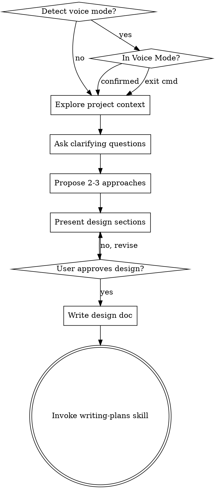

# Brainstorming Ideas Into Designs

## Overview

Help turn ideas into fully formed designs and specs through natural collaborative dialogue.

Start by understanding the current project context, then ask questions one at a time to refine the idea. Once you understand what you're building, present the design and get user approval.

<HARD-GATE>
Do NOT invoke any implementation skill, write any code, scaffold any project, or take any implementation action until you have presented a design and the user has approved it. This applies to EVERY project regardless of perceived simplicity.
</HARD-GATE>

## Anti-Pattern: "This Is Too Simple To Need A Design"

Every project goes through this process. A todo list, a single-function utility, a config change — all of them. "Simple" projects are where unexamined assumptions cause the most wasted work. The design can be short (a few sentences for truly simple projects), but you MUST present it and get approval.

## Checklist

You MUST create a task for each of these items and complete them in order:

1. **Detect voice mode** — if input is long/conversational/filler words, switch to Voice Mode
2. **Handle mode transitions** — if user signals exit (/text, short input), return to normal mode
3. **Explore project context** — check files, docs, recent commits
4. **Ask clarifying questions** — one at a time (in Voice Mode: paraphrase confirm first; handle low-confidence with multiple-choice clarification)
5. **Propose 2-3 approaches** — with trade-offs and your recommendation
6. **Present design** — in sections scaled to their complexity, get user approval after each section (use [VOICE_SUMMARY] + [TEXT_DETAILS] format in Voice Mode)
7. **Write design doc** — save to `docs/plans/YYYY-MM-DD-<topic>-design.md` and commit
8. **Transition to implementation** — invoke writing-plans skill to create implementation plan

## Process Flow



**The terminal state is invoking writing-plans.** Do NOT invoke frontend-design, mcp-builder, or any other implementation skill. The ONLY skill you invoke after brainstorming is writing-plans.

## The Process

**Detecting voice mode:**
- Check if input matches voice-to-text patterns: long (>100 chars), conversational, filler words ("um", "那个", "like"), self-corrections
- In Voice Mode: listen fully before responding, paraphrase to confirm understanding, use hybrid output (voice summary + text details)

**Understanding the idea:**
- Check out the current project state first (files, docs, recent commits)
- Ask questions one at a time to refine the idea
- Prefer multiple choice questions when possible, but open-ended is fine too
- Only one question per message - if a topic needs more exploration, break it into multiple questions
- Focus on understanding: purpose, constraints, success criteria

**Exploring approaches:**
- Propose 2-3 different approaches with trade-offs
- Present options conversationally with your recommendation and reasoning
- Lead with your recommended option and explain why

**Presenting the design:**
- Once you believe you understand what you're building, present the design
- Scale each section to its complexity: a few sentences if straightforward, up to 200-300 words if nuanced
- Ask after each section whether it looks right so far
- Cover: architecture, components, data flow, error handling, testing
- Be ready to go back and clarify if something doesn't make sense

## After the Design

**Documentation:**
- Write the validated design to `docs/plans/YYYY-MM-DD-<topic>-design.md`
- Use elements-of-style:writing-clearly-and-concisely skill if available
- Commit the design document to git

**Implementation:**
- Invoke the writing-plans skill to create a detailed implementation plan
- Do NOT invoke any other skill. writing-plans is the next step.

## Voice Input Mode

When the user's input appears to be voice-to-text (long, conversational, with filler words like "um", "that", "like", "I mean", or self-corrections), automatically switch to Voice Mode:

### Voice Mode Behavior

**Detection criteria** (meets ≥2):
- Input length > 100 characters with conversational structure
- Contains filler words: "那个", "就是", "嗯", "then", "like", "um"
- Contains self-corrections: "不对", "wait", "I mean", "actually"
- Few commas/periods relative to length (stream-of-consciousness)

**Response pattern**:
1. **Listen fully** - Don't interrupt with questions mid-stream
2. **Paraphrase confirm** - Summarize understanding in 1-2 sentences, ask "对吗？/Is that right?"
3. **Hybrid output**:
   ```
   [VOICE_SUMMARY]
   Minimal summary (≤30 seconds to read aloud)

   [TEXT_DETAILS]
   Full structured details with bullet points
   ```
4. **Adaptive questions** - Keep one question at a time, but allow longer voice responses

**Exiting Voice Mode** - User can exit by:
- Typing `/text` or `/文字` command
- Sending short input (<30 chars) without voice patterns
- Explicitly stating "use text mode" or "用文字模式"

**Error handling for low-confidence understanding**:
- If unsure about interpretation, list 2-3 possible understandings
- Format: "I understand you might mean: A) xxx, B) xxx, or C) something else?"
- Wait for user clarification before proceeding

**Example - Successful Understanding**:
```
User: [200-character voice input with "那个" and self-corrections]

Claude: 我理解你想做一个语音记账功能，让用户说"午餐20块"就自动记录，对吗？

[VOICE_SUMMARY]
我理解你想做语音记账，核心是用自然语言快速记录消费，对吗？

[TEXT_DETAILS]
- 输入方式：语音自然语言
- 解析目标：金额 + 消费类别
- 示例："午餐20块" → 金额: 20, 类别: 餐饮
- 语言：中文口语支持

如果理解正确，我的问题是：你希望先支持哪些消费类别？
```

**Example - Low Confidence (when interpretation unclear)**:
```
User: [ambiguous voice input]

Claude: I want to make sure I understand correctly. You might mean:
A) A voice-based expense tracker
B) A voice note-taking app with spending tags
C) Something else entirely

Which one is closest to what you're thinking?
```

**Example - Exiting Voice Mode**:
```
User: /text

Claude: [Switching to text mode - detailed responses without voice summary]
```

## Key Principles

- **One question at a time** - Don't overwhelm with multiple questions
- **Multiple choice preferred** - Easier to answer than open-ended when possible
- **YAGNI ruthlessly** - Remove unnecessary features from all designs
- **Explore alternatives** - Always propose 2-3 approaches before settling
- **Incremental validation** - Present design, get approval before moving on
- **Be flexible** - Go back and clarify when something doesn't make sense
- **Voice-adaptive** - When in Voice Mode, listen fully before responding, confirm understanding before proceeding
